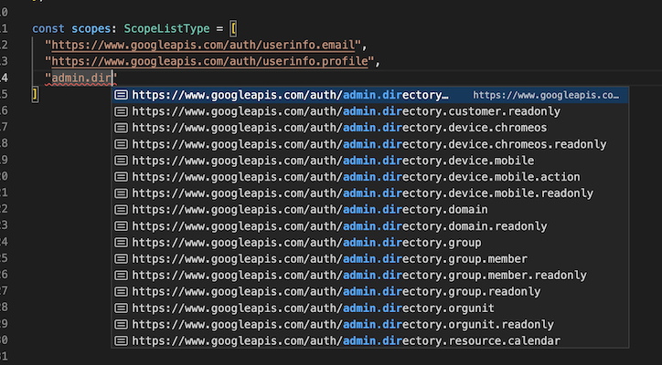

# google-auth-scopes-list

## Intro

Easily setup auto suggest when typed as `ScopeListType`



This repo is basically an array of google authorization scopes with a bit of typescript to give you autosuggest

It was obtained from the google documentation page here:
https://developers.google.com/identity/protocols/oauth2/scopes

## Basic Code Example

### Install

``` shell
npm install google-auth-scopes --save-dev
```

### Import

```typescript
// example.ts

import { ScopeListType } from "google-auth-scopes";

const scopes: ScopeListType = [
  "https://www.googleapis.com/auth/userinfo.email",
  "https://www.googleapis.com/auth/userinfo.profile",
];
```
